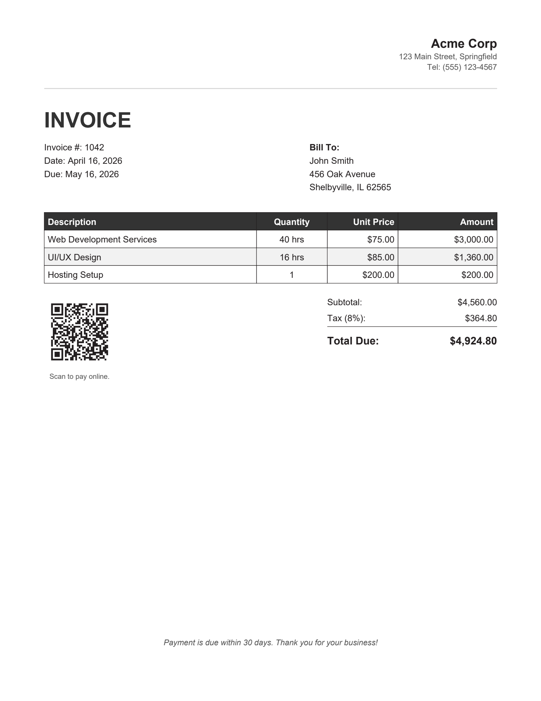
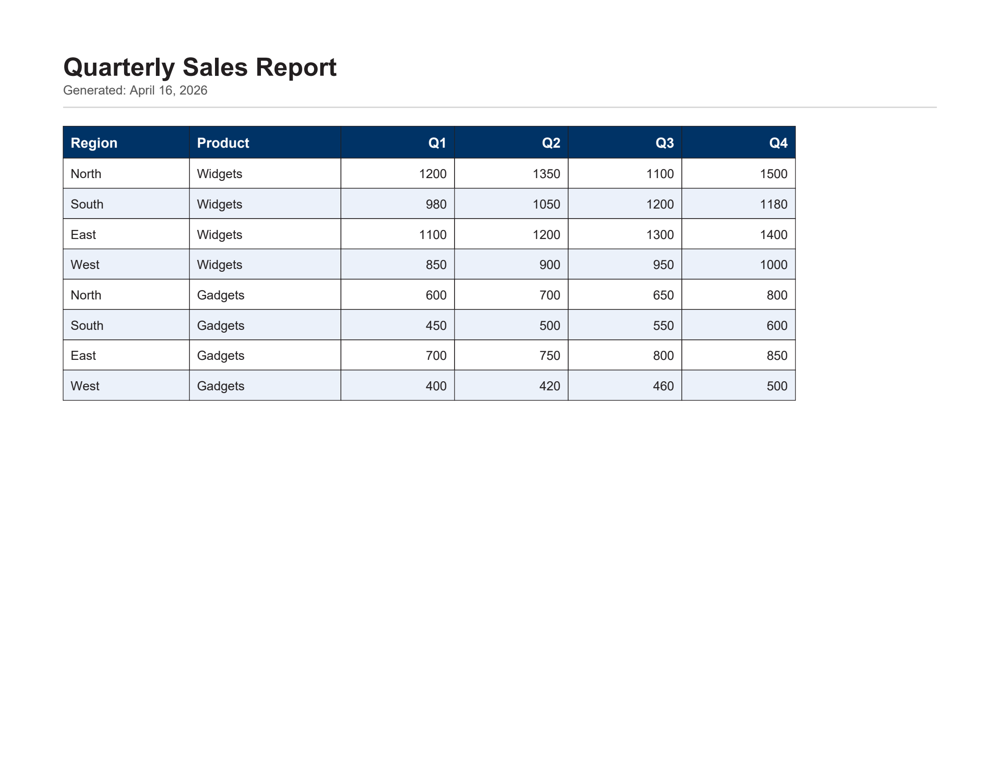

# SimpleTinyPDF

An extremely small, zero-dependency PDF generation library for .NET.

SimpleTinyPDF lets you create PDF documents from C# with no external packages. It targets .NET Standard 2.0, so it works with .NET Framework 4.6.1+, .NET Core 2.0+, and .NET 5+. The API is deliberately small: you add pages, draw text, images, shapes, and tables, then save. There is no DOM, no layout engine, and no markup language — you position everything in points.

## Pros and Cons

**Use SimpleTinyPDF when you want to:**

- Generate invoices, reports, receipts, or labels from code
- Avoid pulling in a large dependency tree for simple PDF output
- Run in constrained environments (Azure Functions, Docker, CI pipelines) without native libraries
- Ship a self-contained app with no runtime font or image dependencies

**Look elsewhere if you need:**

- HTML-to-PDF conversion
- Fonts beyond the 14 standard PDF fonts (no TrueType/OpenType embedding)
- Full Unicode or CJK character support
- Form fields or annotations
- PDF reading, parsing, or editing
- Encryption or digital signatures
- Automatic page layout (headers/footers, page numbers, flowing columns)

## Size Comparison

One of SimpleTinyPDF's goals is to stay tiny. Here's how it compares to other popular .NET PDF libraries (as of April 2026):

| Library | Version | NuGet Package Size |
|---|---|---|
| **SimpleTinyPDF** | 1.0 | ~66 KB |
| **PDFsharp** | 6.2.4 | ~4.41 MB |
| **iText** | 9.6.0 | ~5.02 MB |
| **QuestPDF** | 2026.2.4 | ~35.88 MB |

QuestPDF's size reflects bundled native SkiaSharp binaries.

## API Reference

### PdfDocument

The main entry point. Create one, add pages, then save.

```csharp
var doc = new PdfDocument();
doc.Title = "My Report";
doc.Author = "Jane Doe";

var page = doc.AddPage();                         // A4 by default
var page2 = doc.AddPage(PageSize.Letter);         // US Letter
var page3 = doc.AddPage(PageSize.A4.Landscape()); // A4 landscape
var cover = doc.InsertPage(1);                    // insert at position 1

doc.Save("output.pdf");       // save to file
doc.Save(stream);             // write to stream
byte[] bytes = doc.ToArray(); // get as byte array
```

| Property / Method | Description |
|---|---|
| `Title` | Document title (PDF metadata) |
| `Author` | Document author (PDF metadata) |
| `Pages` | Read-only list of all pages |
| `PageCount` | Number of pages |
| `FirstPage` / `LastPage` | First or last page (null if empty) |
| `GetPage(int pageNumber)` | Get a page by 1-based number |
| `GetPageNumber(PdfPage page)` | Get the 1-based number of a page |
| `AddPage(PageSize)` | Append a new page (defaults to A4) |
| `InsertPage(int, PageSize)` | Insert a page at a 1-based position |
| `AddImage(PdfImage)` | Register an image (deduplicates identical content) |
| `Save(string)` / `Save(Stream)` | Write PDF to file or stream |
| `ToArray()` | Return PDF as a byte array |

### Bookmarks

Add bookmarks (outlines) that appear in the PDF viewer's navigation panel. Bookmarks can be nested to create a hierarchical table of contents.

```csharp
// Top-level bookmarks
var ch1 = doc.AddBookmark("Chapter 1", page1);
var ch2 = doc.AddBookmark("Chapter 2", page2);

// Nested bookmarks — point to a specific Y position on the page
ch1.AddBookmark("Installation", page1, y: 150);
ch1.AddBookmark("Configuration", page1, y: 350);

// Deeper nesting
var advanced = ch2.AddBookmark("Advanced Topics", page3);
advanced.AddBookmark("Performance Tuning", page3, y: 200);
```

| Method | Description |
|---|---|
| `PdfDocument.AddBookmark(title, page, y?)` | Add a top-level bookmark. Returns the bookmark for nesting children. |
| `PdfBookmark.AddBookmark(title, page, y?)` | Add a child bookmark under this one. |

When `y` is omitted the bookmark fits the entire page. When `y` is provided the viewer scrolls to that vertical position (in the page's coordinate system).

### PdfPage

All drawing happens on a page. Coordinates are in points. By default the coordinate system is top-down (Y=0 is the top of the page). Set `CoordinateOrigin` to use native PDF bottom-up coordinates instead.

```csharp
// Default: Y=0 at top, Y increases downward
page.CoordinateOrigin = CoordinateOrigin.TopDown;

// Native PDF: Y=0 at bottom, Y increases upward
page.CoordinateOrigin = CoordinateOrigin.BottomUp;
```

In `BottomUp` mode, Y values map directly to PDF coordinates: text Y is the baseline, and rectangle/image Y is the bottom-left corner. Tables (`DrawTable`) always use top-down layout internally.

**Text**

```csharp
page.DrawText("Hello", 50, 50);
page.DrawText("Bold red", 50, 70, PdfFont.HelveticaBold, 14, PdfColor.Red, TextAlignment.Left, underline: true);

// Hyperlink — text becomes clickable
page.DrawText("Visit Example", 50, 90, PdfFont.Helvetica, 12, PdfColor.Blue,
    underline: true, link: "https://example.com");

// Wrapped text box — returns Y position after last line
float nextY = page.DrawTextBox("Long paragraph...", 50, 110, width: 400,
    font: PdfFont.TimesRoman, fontSize: 11, lineSpacing: 1.4f);

// Wrapped text box with hyperlink (each wrapped line is clickable)
float nextY1 = page.DrawTextBox("Click here for full terms and conditions", 50, 160, width: 200,
    link: "https://example.com/terms");

// Rich text (mixed fonts/sizes/colors on one line)
page.DrawRichText(new[] {
    new TextSpan("Normal "),
    new TextSpan("bold", PdfFont.HelveticaBold),
    new TextSpan(" and ", PdfFont.Helvetica, 12, PdfColor.DarkGray),
    new TextSpan("red", PdfFont.Helvetica, 12, PdfColor.Red, underline: true)
}, 50, 200);

// Rich text with hyperlinks — individual spans can be links
page.DrawRichText(new[] {
    new TextSpan("See "),
    new TextSpan("our docs", PdfFont.Helvetica, 12, PdfColor.Blue,
        underline: true, link: "https://docs.example.com"),
    new TextSpan(" for details.")
}, 50, 220);

// Rich text box (mixed formatting with word wrap.  In this example, spans is an array of TextSpan)
float nextY2 = page.DrawRichTextBox(spans, 50, 240, width: 400);

// Measure text width
float w = page.MeasureText("Hello", PdfFont.Helvetica, 12);
```

| Method | Returns | Description |
|---|---|---|
| `DrawText(...)` | void | Single line of text |
| `DrawTextBox(...)` | float | Wrapped text; returns Y after last line |
| `DrawRichText(...)` | void | Single line with mixed formatting |
| `DrawRichTextBox(...)` | float | Wrapped mixed-format text |
| `MeasureText(text, font, size)` | float | Width of text in points |

**Lists**

```csharp
float y = page.DrawBulletList(
    new[] { "First item", "Second item", "Third item" },
    x: 50, y: 300, width: 400);

y = page.DrawNumberedList(
    new[] { "Step one", "Step two", "Step three" },
    x: 50, y: y, width: 400, startNumber: 1);
```

**Shapes**

```csharp
page.DrawLine(50, 100, 500, 100, PdfColor.Black, lineWidth: 0.5f);
page.DrawRectangle(50, 110, 200, 80, PdfColor.DarkGray, lineWidth: 1f);
page.DrawFilledRectangle(50, 200, 200, 80, PdfColor.Rgb(230, 240, 255), PdfColor.Black, lineWidth: 0.5f);
```

**Images**

```csharp
var logo = PdfImage.FromFile("logo.png");
page.DrawImage(logo, x: 50, y: 30, width: 120, height: 40);
page.DrawImage(logo, x: 50, y: 30, width: 120, height: 40, opacity: 0.5f);
page.DrawImage(logo, x: 50, y: 30, width: 120, height: 40, scaleMode: ImageScaleMode.Fit);
```

JPEG and PNG are supported (auto-detected). PNG transparency is preserved. EXIF orientation tags are automatically applied.

The `scaleMode` parameter controls how the image is scaled to fit the target rectangle:

| Mode | Aspect Ratio | Description |
|---|---|---|
| `Stretch` (default) | Ignored | Fills the entire area exactly; image may be distorted |
| `Fit` | Preserved | Scales to fit inside the area; image is centered with possible letterboxing |
| `Fill` | Preserved | Scales to cover the entire area; image is centered and overflow is clipped |

**Tables**

```csharp
float endY = page.DrawTable(table, x: 50, y: 200, bottomMargin: 50);
```

Tables that exceed the page height automatically continue on new pages with repeated headers. By default, continuation pages start the table at the same Y position as the first page. Use `continuationY` to start higher on subsequent pages:

```csharp
// Table starts at y=300 on page 1, but at y=50 on continuation pages
page.DrawTable(table, x: 50, y: 300, continuationY: 50);
```

### PdfTable

Build tables with a fluent API or import from CSV.

```csharp
var table = new PdfTable(100, 200, 100, 100)  // column widths in points
    .SetHeaders("ID", "Description", "Qty", "Price")
    .AddRow("1001", "Widget", "5", "$12.50")
    .AddRow("1002", "Gadget", "2", "$24.00");

table.SetColumnAlignment(2, TextAlignment.Right);
table.SetColumnAlignment(3, TextAlignment.Right);
table.AlternateRowShading = true;
```

| Property | Default | Description |
|---|---|---|
| `HeaderFont` | HelveticaBold | Font for header row |
| `HeaderFontSize` | 10 | Font size for header row |
| `CellFont` | Helvetica | Font for body cells |
| `CellFontSize` | 10 | Font size for body cells |
| `HeaderBackground` | LightGray | Header row background color |
| `HeaderTextColor` | Black | Header text color |
| `BorderColor` | Black | Border color |
| `BorderWidth` | 0.5 | Border line width in points |
| `CellPadding` | 4 | Padding inside cells in points |
| `TextColor` | Black | Body text color |
| `AlternateRowShading` | false | Enable zebra-stripe rows |
| `AlternateRowColor` | RGB(0.95, 0.95, 0.95) | Alternate row background |
| `LineSpacing` | 1.2 | Line spacing multiplier for cell text |

**CSV import:**

```csharp
var table = PdfTable.FromCsv("data.csv");
var table = PdfTable.FromCsv("data.csv", firstRowIsHeader: true, delimiter: ',',
    columnWidths: new float[] { 80, 200, 80, 80 });
var table = PdfTable.FromCsvString(csvContent, totalWidth: 500);
```

### PdfImage

```csharp
var img = PdfImage.FromFile("photo.jpg");
var img = PdfImage.FromBytes(byteArray);
var img = PdfImage.FromStream(stream);

int w = img.PixelWidth;   // display width (EXIF-adjusted)
int h = img.PixelHeight;  // display height (EXIF-adjusted)
```

### PdfColor

```csharp
var c1 = PdfColor.Rgb(51, 102, 204);        // 0-255 integers
var c2 = PdfColor.Rgb(0.2f, 0.4f, 0.8f);    // 0.0-1.0 floats
var c3 = PdfColor.Cmyk(1f, 0f, 0f, 0f);     // CMYK
var c4 = PdfColor.Gray(0.5f);               // grayscale
```

Predefined colors:

| Name | Value | Color Space |
|---|---|---|
| `Black` | K=1 | CMYK |
| `White` | 255, 255, 255 | RGB |
| `Red` | 255, 0, 0 | RGB |
| `Green` | 0, 255, 0 | RGB |
| `Blue` | 0, 0, 255 | RGB |
| `Yellow` | Y=1 | CMYK |
| `Cyan` | C=1 | CMYK |
| `Magenta` | M=1 | CMYK |
| `Orange` | 255, 165, 0 | RGB |
| `Purple` | 128, 0, 128 | RGB |
| `Pink` | 255, 192, 203 | RGB |
| `Brown` | 139, 69, 19 | RGB |
| `Gold` | 255, 215, 0 | RGB |
| `Navy` | 0, 0, 128 | RGB |
| `Teal` | 0, 128, 128 | RGB |
| `Maroon` | 128, 0, 0 | RGB |
| `Olive` | 128, 128, 0 | RGB |
| `Coral` | 255, 127, 80 | RGB |
| `Crimson` | 220, 20, 60 | RGB |
| `Indigo` | 75, 0, 130 | RGB |
| `Silver` | 192, 192, 192 | RGB |
| `MediumGray` | 128, 128, 128 | RGB |
| `LightGray` | 212, 212, 212 | RGB |
| `DarkGray` | 84, 84, 84 | RGB |

### PageSize

Predefined: `PageSize.A4`, `A3`, `A5`, `Letter`, `Legal`

```csharp
var landscape = PageSize.A4.Landscape();
var custom = new PageSize(400, 600);  // width x height in points
```

### TextSpan

Used with `DrawRichText` and `DrawRichTextBox` for mixed-format text.

```csharp
new TextSpan("hello")                                          // defaults: Helvetica 12pt black
new TextSpan("bold", PdfFont.HelveticaBold, 14)                // custom font/size
new TextSpan("fancy", PdfFont.TimesItalic, 12, PdfColor.Blue, underline: true, opacity: 0.8f)
new TextSpan("click me", PdfFont.Helvetica, 12, PdfColor.Blue, underline: true,
    link: "https://example.com")                               // hyperlink
```

### TextAlignment

`TextAlignment.Left` (default), `TextAlignment.Center`, `TextAlignment.Right`

## Example: Invoice with Company Logo



```csharp
using SimpleTinyPDF;

var doc = new PdfDocument { Title = "Invoice #1042" };
var page = doc.AddPage(PageSize.Letter);

// Company logo
var logo = PdfImage.FromFile("company-logo.png");
page.DrawImage(logo, 50, 40, 150, 50);

// Company info (right-aligned)
page.DrawText("Acme Corp", 562, 40, PdfFont.HelveticaBold, 14, alignment: TextAlignment.Right);
page.DrawText("123 Main Street, Springfield", 562, 58, PdfFont.Helvetica, 9,
    PdfColor.DarkGray, TextAlignment.Right);
page.DrawText("Tel: (555) 123-4567", 562, 70, PdfFont.Helvetica, 9,
    PdfColor.DarkGray, TextAlignment.Right);

// Divider
page.DrawLine(50, 100, 562, 100, PdfColor.LightGray, 1f);

// Invoice title
page.DrawText("INVOICE", 50, 120, PdfFont.HelveticaBold, 24, PdfColor.Rgb(51, 51, 51));

// Invoice details
page.DrawText("Invoice #: 1042", 50, 160, PdfFont.Helvetica, 10);
page.DrawText("Date: April 16, 2026", 50, 175, PdfFont.Helvetica, 10);
page.DrawText("Due: May 16, 2026", 50, 190, PdfFont.Helvetica, 10);

// Bill to
page.DrawText("Bill To:", 350, 160, PdfFont.HelveticaBold, 10);
page.DrawText("John Smith", 350, 175, PdfFont.Helvetica, 10);
page.DrawText("456 Oak Avenue", 350, 190, PdfFont.Helvetica, 10);
page.DrawText("Shelbyville, IL 62565", 350, 205, PdfFont.Helvetica, 10);

// Line items table
var table = new PdfTable(240, 80, 80, 112)
    .SetHeaders("Description", "Quantity", "Unit Price", "Amount")
    .AddRow("Web Development Services", "40 hrs", "$75.00", "$3,000.00")
    .AddRow("UI/UX Design", "16 hrs", "$85.00", "$1,360.00")
    .AddRow("Hosting Setup", "1", "$200.00", "$200.00");

table.SetColumnAlignment(1, TextAlignment.Center);
table.SetColumnAlignment(2, TextAlignment.Right);
table.SetColumnAlignment(3, TextAlignment.Right);
table.HeaderBackground = PdfColor.Rgb(51, 51, 51);
table.HeaderTextColor = PdfColor.White;
table.AlternateRowShading = true;

float tableEndY = page.DrawTable(table, 50, 240);

// Totals
float totalsX = 370;
float totalsY = tableEndY + 15;
page.DrawText("Subtotal:", totalsX, totalsY, PdfFont.Helvetica, 10);
page.DrawText("$4,560.00", 562, totalsY, PdfFont.Helvetica, 10, alignment: TextAlignment.Right);
page.DrawText("Tax (8%):", totalsX, totalsY + 18, PdfFont.Helvetica, 10);
page.DrawText("$364.80", 562, totalsY + 18, PdfFont.Helvetica, 10, alignment: TextAlignment.Right);
page.DrawLine(totalsX, totalsY + 34, 562, totalsY + 34, PdfColor.Black, 0.5f);
page.DrawText("Total Due:", totalsX, totalsY + 42, PdfFont.HelveticaBold, 12);
page.DrawText("$4,924.80", 562, totalsY + 42, PdfFont.HelveticaBold, 12, alignment: TextAlignment.Right);

// Footer note
page.DrawText("Payment is due within 30 days. Thank you for your business!",
    306, 720, PdfFont.HelveticaOblique, 9, PdfColor.DarkGray, TextAlignment.Center);

doc.Save("invoice-1042.pdf");
```

## Example: CSV to Table Report



```csharp
using SimpleTinyPDF;

// Suppose "sales-data.csv" contains:
//   Region,Product,Q1,Q2,Q3,Q4
//   North,Widgets,1200,1350,1100,1500
//   South,Widgets,980,1050,1200,1180
//   ...

var doc = new PdfDocument { Title = "Quarterly Sales Report" };
var page = doc.AddPage(PageSize.Letter.Landscape());

// Report header
page.DrawText("Quarterly Sales Report", 50, 40, PdfFont.HelveticaBold, 20);
page.DrawText("Generated: April 16, 2026", 50, 65, PdfFont.Helvetica, 10, PdfColor.DarkGray);
page.DrawLine(50, 85, 742, 85, PdfColor.LightGray, 1f);

// Import CSV directly into a table
var table = PdfTable.FromCsv("sales-data.csv",
    firstRowIsHeader: true,
    columnWidths: new float[] { 100, 120, 90, 90, 90, 90 });

// Style it
table.HeaderBackground = PdfColor.Rgb(0, 51, 102);
table.HeaderTextColor = PdfColor.White;
table.HeaderFont = PdfFont.HelveticaBold;
table.HeaderFontSize = 11;
table.CellFont = PdfFont.Helvetica;
table.CellFontSize = 10;
table.AlternateRowShading = true;
table.AlternateRowColor = PdfColor.Rgb(235, 241, 250);
table.CellPadding = 6;

// Right-align the numeric columns
table.SetColumnAlignment(2, TextAlignment.Right);
table.SetColumnAlignment(3, TextAlignment.Right);
table.SetColumnAlignment(4, TextAlignment.Right);
table.SetColumnAlignment(5, TextAlignment.Right);

// Draw — if the data has many rows, it will automatically
// continue on new pages with the header row repeated.
// Use continuationY to start the table higher on subsequent pages.
page.DrawTable(table, 50, 100, bottomMargin: 50, continuationY: 50);

doc.Save("sales-report.pdf");
```

## Font Limitations

SimpleTinyPDF uses the 14 standard PDF Type 1 fonts. These fonts are built into every PDF viewer and require no embedding, which keeps the library simple and output files small.

**Available font families:**

| Family | Variants |
|---|---|
| Helvetica | Regular, Bold, Oblique, BoldOblique |
| Times | Roman, Bold, Italic, BoldItalic |
| Courier | Regular, Bold, Oblique, BoldOblique |
| Symbol | (symbol characters) |
| ZapfDingbats | (decorative symbols) |

**Character support:**

- Full WinAnsiEncoding coverage (standard Latin characters, digits, punctuation)
- Extended European characters including Polish, Czech, Slovak, and Hungarian diacritics (e.g. ą, ć, ę, ł, ň, ř, š, ž, ő, ű)
- Characters not in the supported set are replaced with a fallback; they will not cause an error but may not render as expected

**What is not supported:**

- Custom font embedding (TrueType, OpenType, WOFF)
- CJK characters (Chinese, Japanese, Korean)
- Arabic, Hebrew, or other right-to-left scripts
- Emoji

If your project requires custom fonts or broad Unicode support, consider a full-featured PDF library such as QuestPDF, iTextSharp, or PdfSharp.

## Development Notes

This library was written as an exploration of what my increasingly good friend Claude could acomplish.  I continue to be amazed at what generative AI can do.

Sample image assets in the tests project are taken from https://www.publicdomainpictures.net/

## License

MIT
